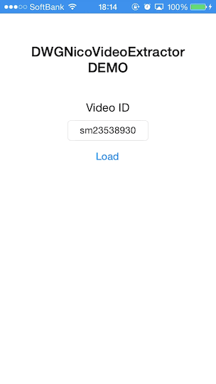

# DWGNicoVideoExtractor

[](https://travis-ci.org/konomae/DWGNicoVideoExtractor)
[](http://cocoadocs.org/docsets/DWGNicoVideoExtractor)
[](http://cocoadocs.org/docsets/DWGNicoVideoExtractor)
[](http://cocoadocs.org/docsets/DWGNicoVideoExtractor)

**DWGNicoVideoExtractor** is a Nico Nico Douga (nicovideo.jp) video URL extractor for iOS.



## Usage

To run the example project, clone the repo, and run `pod install` from the Example directory first.

## Requirements

- Runs on iOS 6.0 and later


## Installation

DWGNicoVideoExtractor is available through [CocoaPods](http://cocoapods.org). To install
it, simply add the following line to your Podfile:

    pod "DWGNicoVideoExtractor"

## Example

```objc
NSString *videoID = @"sm23538930";
[DWGNicoVideoExtractor fetchVideoURLFromID:videoID completion:^(NSURL *videoURL, NSError *error) {
    if (error) {
        NSLog(@"%@", error);
        return;
    }

    MPMoviePlayerViewController *vc = [[MPMoviePlayerViewController alloc] initWithContentURL:videoURL];
    [vc.moviePlayer prepareToPlay];
    [vc.moviePlayer play];
    [self presentMoviePlayerViewControllerAnimated:vc];
}];
```


## Restriction

- Supports embedable videos only


## TODO

- Tests


## License

DWGNicoVideoExtractor is available under the MIT license. See the LICENSE file for more info.

